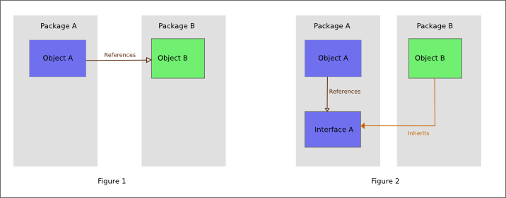
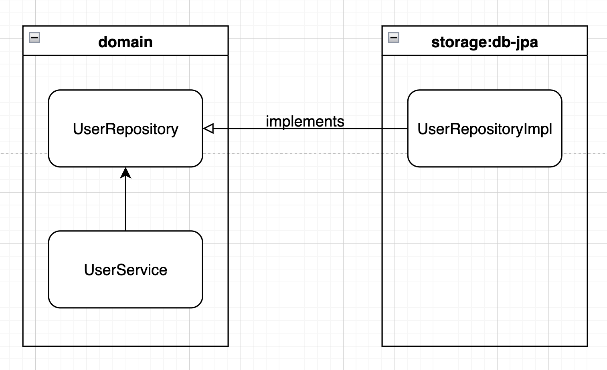

## DIP

### src/main/kotlin/version1
- ~~DIP가 적용되지 않아서 상위 레이어가 하위 레이어에 의존하고 있는 상태입니다.~~

### src/main/kotlin/version2
- ~~DIP가 적용되어 상위 레이어가 하위 레이어에 의존하지 않고 있습니다.~~
- ~~상위 레이어는 하위 레이어가 어떻게 구현되어 있는지 모르고 사용하고 있습니다.~~
- ~~하위 레이어가 변경되어도 상위 레이어에 영향을 주지 않습니다.~~

위의 개선사항은 OCP와 다를게 없는 DIP 이다.

### 작성한 테스트 위치
- core/src/test/kotlin/org/example/core/DipApplicationKtTest.kt

### DIP 정리
1. DIP는 무엇과 무엇의 의존관계에 관한 이야기인가? 
   - DIP는 소프트웨어 모듈 간의 느슨한 결합을 위한 방법론입니다. 이 원칙에 따르면 고수준 모듈과 저수준 모듈 간의 의존 관계가 역전되어 고수준 모듈이 저수준 모듈의 구현 세부사항으로부터 독립됩니다.
2. 의존관계란 무엇인가?
   - 하나의 소프트웨어가 다른 소프트웨어에 기능적으로 의존하는 경우를 말합니다. 프로그램이나 모듈이 실행을 위해 특정 라이브러리를 요구하거나, 한 클래스가 다른 클래스의 메소드나 속성을 사용하는 것을 포함합니다. 
3. 의존관계가 역전되기 전엔 어떤 모양이고 의존관계가 역전되면 어떤 모양인가
   - 클래스간 의존관계를 해결하는 방법 
   - 모듈간 의존관계를 해결하는 방법 
5. 역전되는게 의존관계 뿐인가?
   - 관심사의 분리가 가능합니다. 즉, 하나의 모듈이 다른 모듈에 대한 구현 세부사항을 알 필요가 없습니다. 이는 모듈 간의 결합도를 낮추고, 모듈을 재사용하기 쉽게 만듭니다.
   - 또한, 모듈 간의 의존성이 줄어들면, 모듈을 독립적으로 테스트하고, 변경하기 쉬워집니다.

### 참고
1. https://velog.io/@jh9/%EB%A9%80%ED%8B%B0%EB%AA%A8%EB%93%88-%EB%8F%84%EC%A0%84%EA%B8%B0
2. https://techblog.woowahan.com/2637/
3. https://velog.io/@jonghyun3668/%EC%8A%A4%ED%94%84%EB%A7%81-%EB%B6%80%ED%8A%B8-%EB%8B%A8%EC%9D%BC-%EB%AA%A8%EB%93%88-%EC%BD%94%EB%93%9C%EC%97%90-%EB%A9%80%ED%8B%B0-%EB%AA%A8%EB%93%88%EC%9D%84-%EC%A0%81%EC%9A%A9%ED%95%98%EC%97%AC-%ED%94%84%EB%A1%9C%EC%A0%9D%ED%8A%B8-%EA%B5%AC%EC%A1%B0-%EA%B0%9C%EC%84%A0%ED%95%98%EA%B8%B0